<!-- textura-banner -->
<div align="center">
  <a href="https://github.com/beepboop2025/ReadyState"></a>
</div>

# ReadyState

**Personal resilience dashboard -- track your preparedness across six life domains with live market threat intelligence.**


---

## Features

- **Readiness Score (0--100)** -- Animated SVG gauge with a red-to-green gradient arc that responds in real time to checklist progress and threat levels.
- **Multi-Domain Tracking** -- Six scored domains (Finance, Health, Career, Skills, Network, Mental), each with weighted checklist items ranked Critical, Important, or Nice-to-have.
- **Domain-Specific Checklists** -- Progress bars and expert tips per domain; unchecked items auto-sorted by weight from your weakest areas.
- **Glassmorphism UI** -- Frosted-glass panels with domain-colored glows, smooth transitions, and a light/dark theme toggle in Settings.
- **Live Threat Intelligence** -- Connects to DragonScope for real-time market signals (yield curve, fear/greed index, unemployment) that dynamically raise or lower threat levels.
- **Crisis Scenario Planner** -- Eight scenarios (job loss, natural disaster, cyberattack, pandemic, and more) with weighted domain-impact analysis and effective-risk calculations.
- **6-Domain Radar Chart** -- Visual balance view across all domains using Recharts.
- **Trend Tracking** -- 90-day score history rendered as an area chart.
- **100% Local by Default** -- All checklist data lives in localStorage. No accounts, no telemetry.

---

## Tech Stack

### Frontend

| Layer | Technology |
|-------|------------|
| Framework | React 18, TypeScript (strict mode) |
| Build | Vite 5 |
| Styling | Tailwind CSS 3, glassmorphism design system |
| Charts | Recharts (radar, area, gauge) |
| Icons | Lucide React |
| State | React Context + useReducer + localStorage |

### Backend (optional)

| Layer | Technology |
|-------|------------|
| API | FastAPI |
| Database | PostgreSQL 17 (async via SQLAlchemy) |
| Cache | Redis 7 |
| Data Sources | DragonScope API, FRED, NOAA |
| Deploy | Docker Compose |

---

## Getting Started

### Frontend

```bash
git clone https://github.com/beepboop2025/ReadyState.git
cd ReadyState
npm install
npm run dev
```

The app opens at `http://localhost:5173` and works immediately with no backend required.

### Backend (Docker)

The optional backend adds persistent storage, economic indicators from FRED, and weather alerts from NOAA.

```bash
# Set the required Postgres password
export POSTGRES_PASSWORD=your_secure_password

# Start PostgreSQL + Redis + FastAPI
docker compose up
```

The API will be available at `http://localhost:8000`.

### DragonScope Integration

ReadyState can pull live market data from [DragonScope](https://github.com/beepboop2025/DragonScope) for real-time threat scoring. Start the DragonScope data server and ReadyState will auto-connect:

```bash
cd DragonScope && node server/dataServer.js
```

---

## License

Source-available, not open source. See [LICENSE.md](LICENSE.md) for what is permitted.
