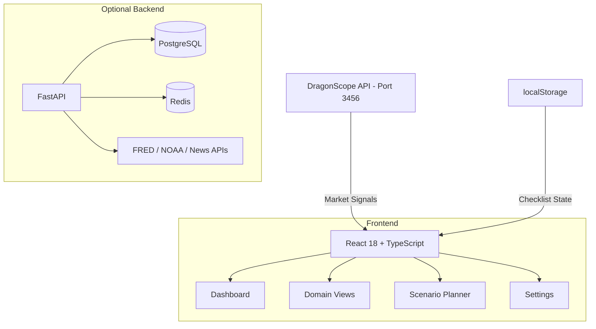

# ReadyState

**Personal resilience intelligence dashboard — score your preparedness across 6 life domains with live market threat intelligence.**


<!-- Add screenshot or demo GIF here -->
> Replace this with a screenshot showing the readiness gauge, radar chart, and threat environment panel

---

## The Concept

Nobody scores their personal resilience the way institutions score risk. ReadyState does.

**73 weighted checklist items across 6 life domains**, dynamically adjusted by live market signals — yield curve inversions, fear & greed indices, unemployment spikes. Your readiness score drops when real-world threats increase, showing you exactly where to focus.

---

## Table of Contents

- [Features](#features)
- [Quick Start](#quick-start)
- [The 6 Domains](#the-6-domains)
- [Crisis Scenarios](#crisis-scenarios)
- [Architecture](#architecture)
- [Tech Stack](#tech-stack)
- [Configuration](#configuration)
- [Roadmap](#roadmap)
- [License](#license)

---

## Features

| | Feature | Description |
|---|---------|-------------|
| :dart: | **Readiness Score (0-100)** | Animated SVG gauge with threshold-based color coding |
| :brain: | **73 Weighted Checklist Items** | Critical/Important/Nice-to-have with expert tips |
| :chart_with_upwards_trend: | **Live Threat Intelligence** | Real-time market signals dynamically adjust threat levels |
| :radar: | **6-Domain Radar Chart** | Visual balance across Financial, Supplies, Digital, Health, Skills, Network |
| :warning: | **8 Crisis Scenarios** | Job loss, natural disaster, cyberattack, pandemic, power outage, medical emergency, recession, relocation |
| :bulb: | **Smart Prioritization** | Unchecked items auto-sorted by weight from your weakest domains |
| :chart_with_downwards_trend: | **Trend Tracking** | 90-day score history with area chart |
| :mag: | **Global Search** | Cmd+K full-text search across all checklist items |
| :lock: | **100% Local** | All data in localStorage — no accounts, no telemetry |
| :dragon: | **DragonScope Integration** | Embedded as a native panel in [DragonScope](https://github.com/beepboop2025/DragonScope) — syncs via localStorage |

---

## DragonScope Integration

ReadyState is available as a **built-in panel** inside [DragonScope](https://github.com/beepboop2025/DragonScope), the open-source financial terminal.

- Open DragonScope → press `Cmd+K` → search "Readiness" to add the panel
- Your checklist data syncs bidirectionally via `localStorage` — run both apps and changes appear in both
- The DragonScope panel computes threat levels directly from live market data (no separate API needed)
- Joint Docker setup available in DragonScope's `docker-compose.yml`

---

## Quick Start

```bash
git clone https://github.com/beepboop2025/ReadyState.git
cd ReadyState
npm install
npm run dev
```

Opens at `http://localhost:3001`. Works immediately — no backend required.

### With Live Threat Data

Start DragonScope's data server for real-time market signals:

```bash
cd DragonScope && node server/dataServer.js
# ReadyState auto-connects on port 3456, polls every 2 minutes
```

### Full Stack (Optional FastAPI Backend)

```bash
docker compose up
# PostgreSQL + Redis + FastAPI backend
```

---

## The 6 Domains

| Domain | Weight | Items | Covers |
|--------|:------:|:-----:|--------|
| **Financial** | 20% | 13 | Emergency fund, insurance, debt, estate planning, income resilience |
| **Supplies** | 18% | 14 | Water, food, first aid, tools, go-bag, vital documents, 7-day stockpiles |
| **Digital** | 15% | 12 | Password manager, 2FA, backups (3-2-1 rule), encryption, account recovery |
| **Health** | 17% | 11 | Medical records, fitness, vaccinations, mental health, medications |
| **Skills** | 15% | 12 | First aid, CPR, home repairs, career resilience, AI literacy, navigation |
| **Network** | 15% | 11 | ICE contacts, community ties, evacuation plans, mutual aid, comm backup |

Each item is weighted 1-3 (Nice-to-have, Important, Critical). Domain scores combine into an overall readiness score.

---

## Crisis Scenarios

8 scenarios with weighted domain impact analysis:

| Scenario | Severity | Key Domains |
|----------|:--------:|-------------|
| Job Loss | High | Financial, Skills, Network |
| Natural Disaster | Critical | Supplies, Health, Network |
| Cyberattack | High | Digital, Financial |
| Pandemic | High | Health, Supplies, Financial |
| Power Outage | Medium | Supplies, Digital |
| Medical Emergency | Critical | Health, Financial, Network |
| Economic Recession | High | Financial, Skills |
| Forced Relocation | Medium | Supplies, Network, Financial |

### Live Signal Integration

Market signals dynamically adjust threat levels:

| Signal | Effect |
|--------|--------|
| Yield curve inverted | +25 economic crisis threat |
| Fear & Greed ≤ 20 | +20-25 overall threat |
| Unemployment > 6% | +30 job loss, +10 medical |
| 5+ hack/breach mentions | +30 cyberattack threat |
| Reddit bearish > 60% | +8-10 spread across threats |

**Effective Risk** = Threat Level × (1 - Readiness/100)

---

## Architecture



Frontend-first design. All checklist data stays in localStorage. The backend is optional — adds economic indicators (FRED), weather alerts (NOAA), and persistent user profiles.

---

## Tech Stack

| Layer | Technology |
|-------|-----------|
| Frontend | React 18, TypeScript (strict), Vite 5, Tailwind CSS 3 |
| Charts | Recharts (radar, area) |
| State | React Context + useReducer + localStorage |
| Icons | Lucide React |
| Backend (optional) | FastAPI, SQLAlchemy async, PostgreSQL, Redis |
| Data Sources | DragonScope API, FRED, NOAA |
| Deploy | Vite static build, Docker Compose |

---

## Configuration

**Frontend** (works out of the box):

| Variable | Default | Description |
|----------|---------|-------------|
| `VITE_DRAGONSCOPE_URL` | `http://localhost:3456` | Live market data source |

**Backend** (optional, for Docker):

| Variable | Description |
|----------|-------------|
| `READYSTATE_DATABASE_URL` | PostgreSQL or SQLite connection |
| `READYSTATE_FRED_API_KEY` | Federal Reserve API (optional) |
| `READYSTATE_NEWS_API_KEY` | News aggregation (optional) |

---

## Roadmap

- [ ] Household profiles (track readiness per family member)
- [ ] Geolocation-based threat adjustments (earthquake zones, flood plains)
- [ ] Community readiness groups (shared checklists with neighbors)
- [ ] Mobile app with push notifications for threat spikes
- [ ] Integration with smart home sensors (power, water, temperature)

---

## License

MIT
